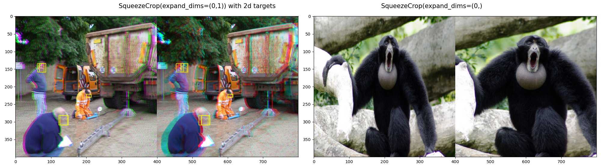

# Data Transforms

All transforms are typed with a class attribute `__type__`, and inherit from class `transforms_base.Transform`, a thin wrapper over `object` handling `__repr__` and kwarg updates on call.

Most transforms (except of `__type__` `IO` and `Compose`) can be used with cuda devices and within differentable operations. Transform values can be randomized with most of the continuous distributions from `torch.distributions`, where defined with classes `Values` and `Probs`. See Randomization form more info.

Trasformation types are: `IO`, `Compose`, `Sizing`, `Appearance`, `Affine`.

Transform classes call similarly named functionals which handle different elements in the data passed generically wrapped with function `functional_base.transform()`. The purpose of `transform()` is clone or profile the data if requested.

## IO Transforms
**`__type__ = 'IO'`** Not strictly 'augmentations' they have similar rules.

### Open()
Opens image file as tensor . TODO: videos, audio, pointclouds
### Show()
General utility to show images. Can be called on `Item()`, `(Item(),...)`, `tensor`, `(tensor, ...)`. Plots 2d annotations.
## Composition Transforms
**`__type__ = 'Compose'`**
### Compose
Similar to torchvision.Compose with Bernoulli probability per transform, and max transforms
<!-- ### TwoCrop
### MultiCrop
### Fork
### Laplacian 
not translated yet
-->

## Randomization of transform parameters
All transforms, other than 'IO' and 'Compose' can be randomized. Randomization is performed by two classes, **`Values()`** and **`Probs()`** deriving from **`torch.distrbutions`** managing distribution properties. Randomization of values can occur along any dimension for `Appearance` and `Affine`; on `Sizing` transforms randomization is restricted to batch and channel dimensions.

`Values()`, a managed wrapper to a subset of `torch.distributions`  defaulting to `Uniform()`. Any transform parameter defined leveraging this class can be constant or probabilisict, affect batch, sample, or single pixels. i.e. Any value parameter can be enything fom single float to an image, constant or probabilisitc.<br> 

**value kwargs available to transforms**:
*  `a, b, **kwargs`  distribution parameters kwargs of the distribution in question, e.g. `{'loc':0,'scale':2}` or `{'a':0,'b':2}`, the latter syntax is type checked and broadcasted. On transforms with more than one randomizable value (e.g. `Normalize(mean, center`)) the kwarg secondary value is suffixed to the name of the argument, e.g. `mean`, `mean_a`, `mean_c`...
*   `center: bool = True  ` centered distributions (Normal, Laplace, Gumbel) can reintepret 'a' and 'b' to be values at 3 standard deviations
*   `distribution: str = 'Uniform'`
*   `expand_dims: int, tuple = None  `   independent dims, eg. if `dims=0`, returns `N` random values; `dims=(0,1)` returns `N*C` values; `dims=(0,1,2,3)` returns `N*C*H*W` values. Each value modulates augmentation transform.  
*   `seed: int = None  `   calls `torch.manual_seed(seed)` # TODO: warn on multiple calls per session
*   `dtype, device`   presets the dtype and device - if they differ from the data, the Distribution is adjusted on call.

`Probs()` is a thin wrapper over `Values()` with a Bernoulli modulation of the probablity of an augmentation taking place or not. Like Values(), Probs() can be applied per batch, sample, channel or any folllowing dimensions. kwargs to Probs are: 
* `p: int, float tensor`   Bernoulli probability
* `p_dims` redirects to expand_dims 

## Sizing Transforms
**`__type__ = 'Sizing'`**
Transforms leveraging nn.interpolate. Dimensions can be expanded per batch or channel. Sizing transforms have no bernoulli probability p and target size is constant, random parameters are related to cropping and transforming only.

### **SqueezeCrop()**
```python
  # respectively
  SC = SqueezeCrop(for_display=True, ratio=0, ratio_b=1, distribution='Normal', size=400,  expand_dims=(0,1))
  SC = SqueezeCrop(for_display=True, ratio=0, ratio_b=1, distribution='Categorical', size=400,  expand_dims=(0,))
  SC(item)
```
<div align="center">
  
</div>

## Appearance Transforms
**`__type__ = 'Appearance'`**

### **Normalize()**
With alias  `MeanCenter()` standard normalization. Typycally for `x` in dataset `X`, `(x - X.mean())/X.std()`. Arguments `'mean'` and `'std'`  can inherit from class `Values()` i.e be probabilistic. 

***WIP TODO: missing probability of mean and std values***

### **UnNormalize()**
Inverse of normalize `x * X.std() + X.mean()`, has alias `UnMeanCenter()`

### **NormToRange()**
Feature scaling, by default to 0-1, most common use case `NormToRange(minimum=0, maximum=1)`. `'minimum'` and `'maximum'` can inherit from class `Values()` i.e. be probabilistic.

### **Saturate()**
One probabilistic argument `'a'`. Changes saturation values, `Saturate(a=0, p=1)` converts to grayscale. `Saturate(a=-1, b=2, distribution='Uniform', p=0.5, p_dims=0, expand_dims=(0,1)) ` outputs random distribution samples between inverse and over saturation over samples and channels, with 50% probability over sample.
```python
# Example Saturate with Categorical distribution over values (-2, 0, 3, 10) with 90% probability.
d = I.__getitem__()
img = merge_items((d,d,d,d))
Sat = Saturate(a=-2, b=3, c=10, d=0, p=0.9, p_dims=0, expand_dims=0, distribution="Categorical", for_display=True)
Show()(Sat(img))
```
<div align="center">
  
</div>
Random Saturate with Gumbel distribution and different expand dims: (0,1,3), (0,1,2,3), None, (1,) 
<div align="center">
  
</div>


### **Gamma()**
Apply gamma `img^(from_gamma/target_gamma)`. One probabilistic argument, target gamma `'a'`, one constant, `from_gamma=2.2 `. 

### **SoftClamp()**
Piecewise Tanh feature scaling. Min, max fixed at 0,1. Softness of the tanh or inflection point are variables that can inherit from class `Values()`.

<div align="center">
  
  
</div>

## Affine Transforms

